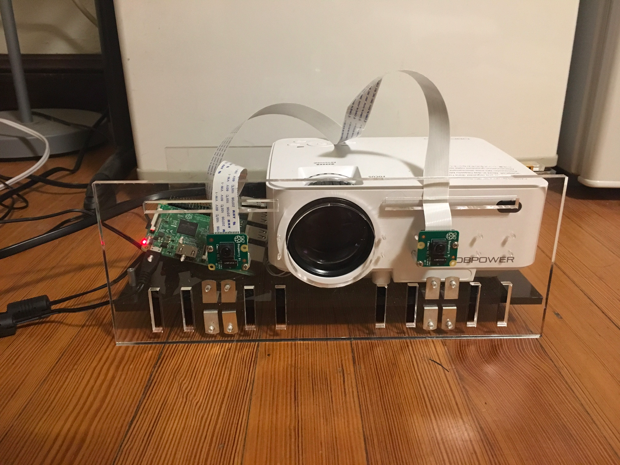
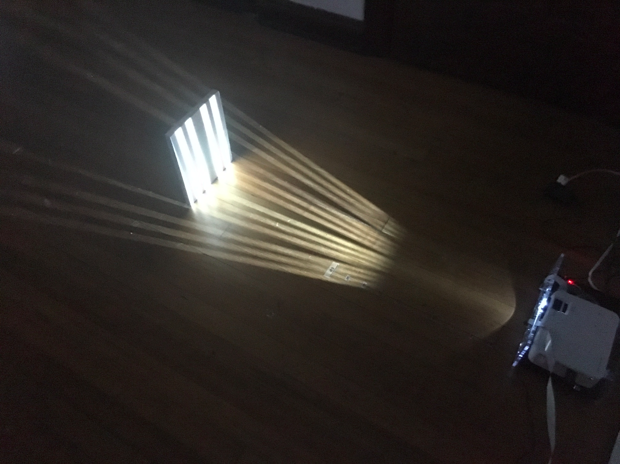
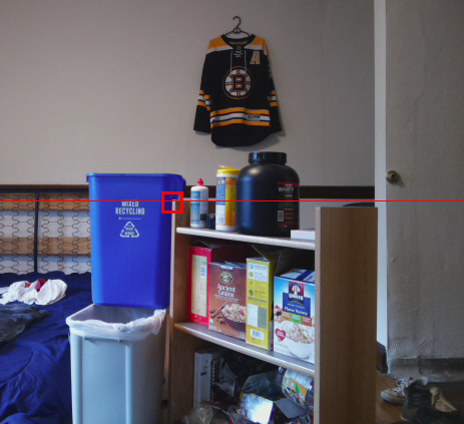
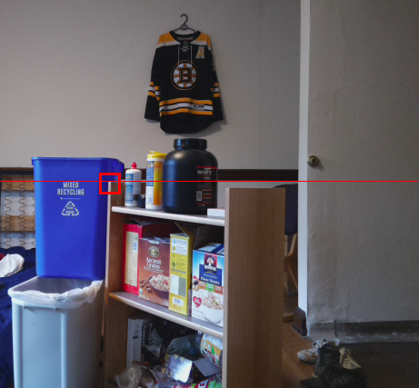
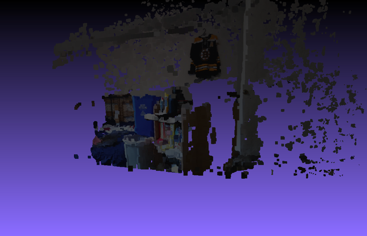
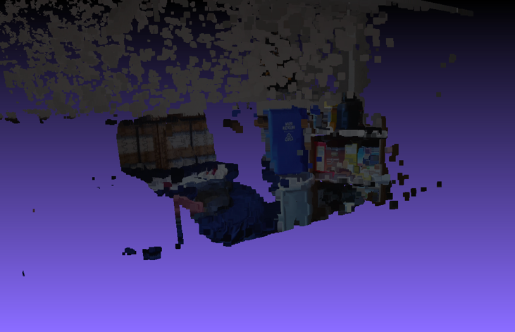

Structured light depth cameras offer a fast and accurate means of depth-estimation for virtual and augmented reality applications. By projecting light-encoded information into a scene and taking images from two different camera perspectives, we can calculate camera pixel displacement and then triangulate the depth of each pixel.

For a given point P in the scene whose x coordinate is xl as seen from camera L and xr as seen from camera R, we can calculate its depth z by using similar triangles. Substituting for x we arrive at the equation z = f (b / xl-xr) where xl-xr is the pixel displacement. Therefore our reconstruction algorithm is as follows: for a pair of images, find the correspondance between every pixel, measure the displacement, and calculate depth.

The camera apparatus consists of two Raspberry Pi Model B's and Camera Module v2's, and a DBPower LCD projector. The cameras are mounted on an acrylic mast at a known distance apart in a fronto-parallel geometry. The body of the mast holds the projector and the Raspberry Pi’s.

Projecting light patterns, in this case black and white stripes, adds uniqueness into the scene that allows us to solve the pixel correspondance problem.

Here are a pair of images of a scene in my dorm room, with two corresponding pixels highlighted that are clearly displaced.

3D point clouds of the scene plotted in Meshlab.
